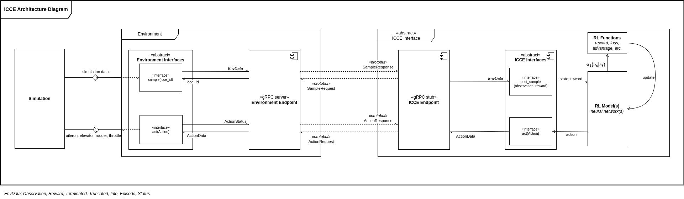
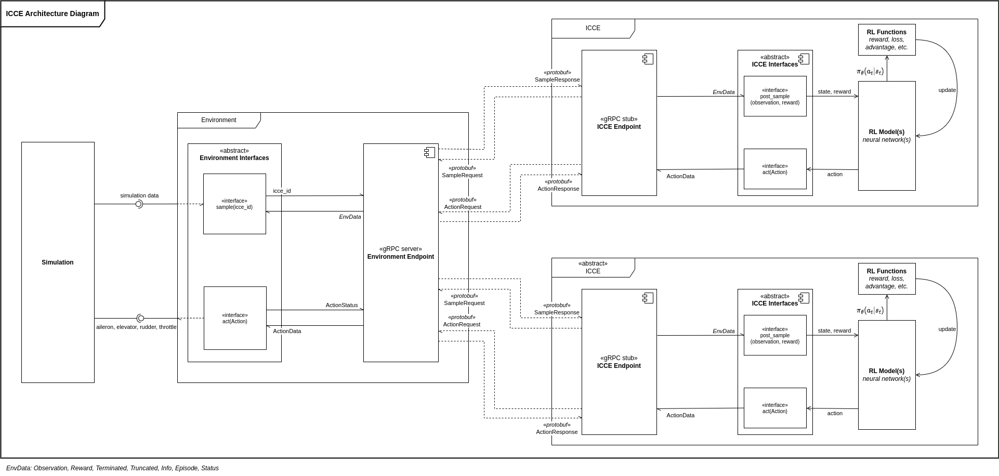
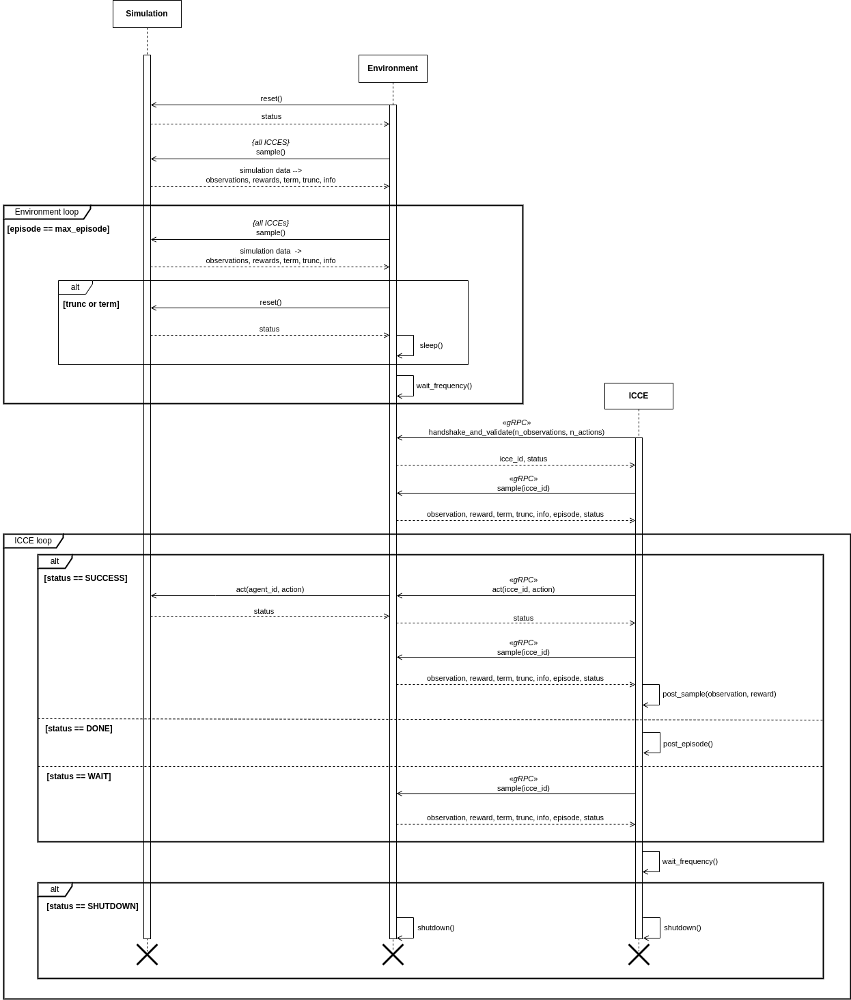

# Intelligent Computer Controlled Entities
The ICCE framework is developed to support research, testing, and evaluation of ICCEs in scalably and extensibly.

* Scalability: Cater to the development of multiple ICCEs (which can be of different RL algorithms) connected to the same simulation
* Extensibility: Simulations should be easily interchangeable and/or ICCEs of different RL algorithms can be developed and tested modularly.

*Note: Click [here](#installation) to skip to Installation guide, and [here](#usage) to skip to Usage guide.*

## Framework Description
The framework is developed to be modular such that working with different simulations or more importantly, ICCEs with different underlying RL algorithms can be developed or tested. In technical terms, the **user implementing their own Simulation, Environment, and/or ICCE would only require to override specific interfaces to suit their needs**.<br>
*see also: Unity's `Update()`, `FixedUpdate()`, etc.*

In a Single-Agent Reinforcement Learning environment (SARL), the overall architecture is depicted as such:



In Multi-Agent Reinforcement Learning environment (MARL), the overall architecture now consists of additional ICCE units, depicted as such:



The sequence of execution is depicted in this sequence diagram.



There are three important components which the user needs to understand:
1. Simulation
2. Environment
3. ICCE


## Simulation
The simulation is the piece of software which simulates a synthetic environment, containing the virtual entity controlled by the ICCE.

The choice of simulation is left up to the user, with the limitation that an interface exists which allows a piece of code to pull simulation data and set actions of an individual simulation entity, (E.g. Using VR-Link to receive/publish data to VR-Forces.), as well as a way to reset the simulation (or reset the state of the simulation to a preset state).

## Environment
The environment acts as an intermediary between the simulation and the ICCE. In the background, the environment maps ICCEs to simulation entities (with their unique identifier) and validates the input (state) and output (action) sizes of the ICCE with that of the environment.

The user must define several interfaces when implementing the environment, using the interfaces provided by the simulation as mentioned in the previous section.

### Interfaces
In total, there are **three** interfaces which the user is required to define.

#### `sample(self, agent_id: int) -> tuple[np.ndarray, float, bool, bool, dict]`
This interface is called whenver the environment attempts to sample simulation data from the simulation. Users are expected to use the unique identifier of simulation entity (as previously registered) and the provided interfaces of the simulation (e.g. VR-Link) to retrieve simulation data, and compute environment data `[observation, reward, term, trunc, info]` to be returned.

#### `reset(self)`
This interface is called whenever any agents' `term` or `trunc` flag is set to `True`. The user is expected to call the provided interface of the simulation to reset the simulation to a starting state.

#### `act(self, agent_id, action: ndarray)`
This interface is called whenever an action is received from the ICCE. The user is expected to translate the `action` of type `ndarray` to an action which is recognizable by the simulation, and call the provided interface of the simulation to set the action of a specified simulation entity, `agent_id`.

## ICCE
The ICCE encapsulates the underlying RL algorithm, allowing it to communicate with the environment for training and inference.

### Interfaces
In total, there are **three** interfaces which the user is required to define.

#### `act(self, observation: ndarray) -> ndarray`
This interface is called whenever the ICCE attempts to take an action. The user is expected to use the observation alongside the RL policy to make an inference, obtaining the action of type `ndarray`.

#### `post_sample(self, observation: ndarray, reward: float)`
This interface is called whenever environment data is sampled from the environment. This occurs after `act` has been called. A common use of this interface is to train the policy after an observation is acquired after taking an action for online training.

#### `post_episode(self)`
This interface is called at the end of an episode. Users can utilize this interface to define training code which includes but not limited to optimizing the policy using `optimizer.step()`.


## Installation
The project has been set-up as a python package, where installation of the project and dependencies are done through a `pip install` call. As this project is still in development, users are expected to clone this project, and do a local, editable installation of the package into their own project.

The steps to setting up a new project which utilizes the ICCE framework is as follows:
1. Clone the ICCE repository into a directory of your choice.
2. Create a separate directory to house the project: `mkdir [project name]`.
3. Create a new virtual environment using a virtual environment of your choice (`venv`, `virtualenvwrapper`, etc.) and activate it.
4. Navigate to the project directory: `cd [project name]`.
5. Locally install the ICCE package as an editable using `pip install -e [path to ICCE directory]`.
6. Now your virtual environment is set-up to utilize the modules implemented in the ICCE package.

## Usage
*Note: Your simulation software must have an interface which supports retrieving and publishing data to and from the simulation, as well as functionality to reset the simulation.*

This section elaborates on how to implement your own environment and ICCE using the framework.

### Environment
With the ICCE package installed into the activated virtual environment, create a python script called `Environment.py` and open the file with your editor of choice.
```
touch Environment.py
```

Import `EnvironmentInterface` from the ICCE package, located in the `interfaces` sub-module.
```python
from ICCE.interfaces import EnvironmentInterface
```

Create a class `Environment` which derives from `EnvironmentInterface`, and define the `__init__` function which initializes the observation and action sizes.
```python
class Environment(EnvironmentInterface):
    def __init__(self):
        super().__init__(max_episodes=1000) # Defines the number of episodes to train for

        # Set input/output sizes
        self.n_observation = 30
        self.n_action = 4

        # Register simulation entities using their unique identifier
        self.register(0)
        self.register(1)
```

Implement the interfaces as described under [Environment Interfaces](#interfaces).
```python
    def sample(self, agent_id: int) -> tuple[np.ndarray, float, bool, bool, dict]:
        # TODO: Pull data from simulation and compute environment data
        return obs, reward, term, trunc, info

    def reset(self):
        # TODO: Call simulation provided interface to reset simulation
        # TODO: Alternatively, use provided interface to reset entities to original position

        return True

    def act(self, agent_id: int, action: np.ndarray):
        # TODO: Translate ndarray actions to simulation acceptable actions
        # TODO: Call simulation provided interface to set action of a specific entity
```

Write a `main()` function to run the environment.
```python
env = Environment()
env.run()

if __name__ == '__main__':
    main()
```

### ICCE
Create a python script called `ICCE.py` and open the file with your editor of choice.
```
touch ICCE.py
```

Import `ICCEInterface` from the ICCE package, located in the `interfaces` sub-module.
```python
from ICCE.interfaces import ICCEInterface
```

Create a class `ICCE` which derives from `ICCEInterface`, and define the `__init__` function which initializes the observation and action sizes.
```python
class ICCE(ICCEInterface):
    def __init__(self):
        # frequency_hz: The update frequency of the agent
        # agent_hint: The unique identifier of a simulation entity which the ICCE will attempt to connect to.
        super().__init__(frequency_hz=60, agent_hint=0)
        self.n_observations = 30
        self.n_actions = 4
```

Implement the interfaces as described under [ICCE Interfaces](#interfaces-1).
```python
    def act(self, observation: np.ndarray) -> np.ndarray:
        # TODO: Use the observation with the RL policy for inference
        return action

    def post_sample(self, observation: np.ndarray, reward: float):
        # TODO: Implement functionality that should execute by observing the environment after act()

    def post_episode(self):
        # TODO Implement functionality that should execute after an episode completes
```

Write a `main()` function to run the ICCE.
```python
icce = ICCE()
icce.run()

if __name__ == '__main__':
    main()
```